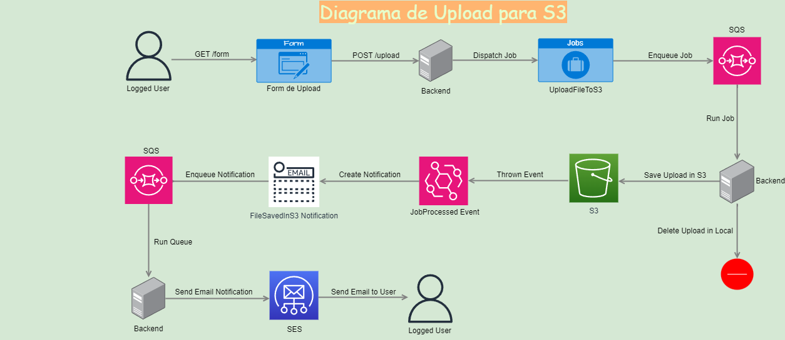
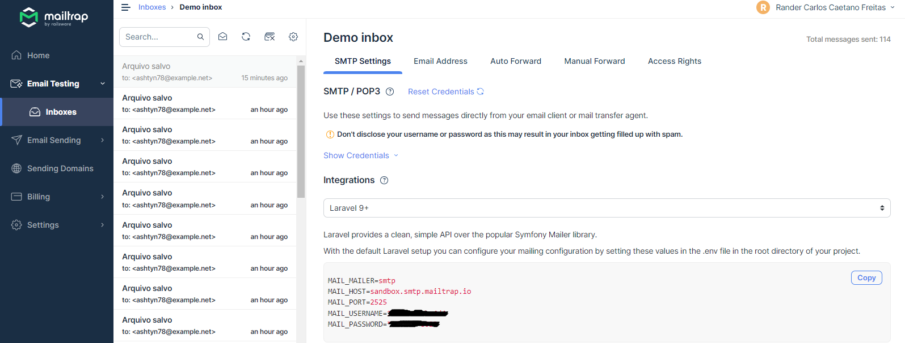

<h4 align="center">
  🚀 Projeto de Integração do Laravel com Localstack
</h4>



<p align="center">
    

  
</p>

<p align="center">
  <a href="#rocket-tecnologias">Tecnologias</a>&nbsp;&nbsp;&nbsp;|&nbsp;&nbsp;&nbsp;
  <a href="#-projeto">Projeto</a>&nbsp;&nbsp;&nbsp;|&nbsp;&nbsp;&nbsp;
  <a href="#-funcionalidades">Funcionalidades</a>&nbsp;&nbsp;&nbsp;|&nbsp;&nbsp;&nbsp;
  <a href="#-requisitos">Requisitos</a>&nbsp;&nbsp;&nbsp;|&nbsp;&nbsp;&nbsp;
  <a href="#-instalação">Instalação</a>&nbsp;&nbsp;&nbsp;|&nbsp;&nbsp;&nbsp;
</p>

<br>

## :rocket: Tecnologias

Esse projeto foi desenvolvido com as seguintes tecnologias:

- [PHP 8.2](https://php.net)
- [Laravel 10](https://laravel.com)
- [Localstack](https://docs.localstack.cloud/overview/)
- [Docker](https://docker.com)
- [AWS CLI](https://docs.aws.amazon.com/cli/latest/userguide/getting-started-install.html)
- [Python 3](https://www.python.org/downloads/)
- [Pip 3](https://packaging.python.org/en/latest/tutorials/installing-packages/)
- [AWSLocal](https://github.com/localstack/awscli-local)


## 💻 Projeto

- Esse projeto é uma demonstração de uma aplicação laravel usando os serviços da AWS através da ferramenta do localstack de forma totalmente local sem conta na AWS.


## 💻 Funcionalidades

O sistema possui as seguintes funcionalidades:

- Permite ao usuário fazer upload de um arquivo qualquer.
- O upload realizado é salvo num bucket da AWS S3.
- Usuário recebe um email com um link para baixar o arquivo de upload.
- Permite excluir um upload salvo no bucket da AWS.
- Envia ao usuário um link informando que upload foi excluido com sucesso.

## 📄 Requisitos

* PHP 8.2+, Laravel 10+, MySQL 5.7, Docker, Localstack, AWS CLI, AWSLOCAL(opcional)


## ⚙️ Instalação e execução

**Windows, OS X & Linux:**
Obs: todos os comandos abaixo são para linux. Se você usa Windows ou Mac, adapte os comandos para o SO usado.

Assumindo que tenha o *docker* instalado, *aws cli* instalado e configurado e o *awslocal* instalado.

Baixe o arquivo zip e o descompacte ou baixe o projeto para sua máquina através do git clone [https://github.com/randercarlos/laravel-localstack](https://github.com/randercarlos/laravel-localstack)

- Entre no prompt de comando e vá até a pasta do projeto:

```sh
cd ir-ate-a-pasta-do-projeto
```

- Crie o arquivo .env a partir do arquivo .env.example. As variáveis de ambiente relacionadas ao banco já estão configuradas.

```sh
cp .env.example .env
```

- Para garantir que não ocorrerá erros de permissão ou de conexão ao banco, execute os comandos abaixo:

```sh
sudo rm -rf ___docker/mariadb/
chmod -R 777 bootstrap storage
``` 

- Assumindo que tenha o docker instalado na máquina, para subir os containeres, execute o comando:

```sh
docker-compose up -d
```

- Depois, crie as tabelas rodando o comando abaixo:

```sh
docker-compose exec localstack-app php artisan migrate --seed
``` 

- Após rodar o comando acima, será necessário configurar as variáveis de ambiente para envio de email. Recomendo o uso do mailtrap conforme imagem abaixo:

    

- Use as configurações mostradas pelo mailtrap e use para configurar as seguintes variáveis de ambiente no arquivo **.env**:

```sh
MAIL_MAILER=
MAIL_HOST=
MAIL_PORT=
MAIL_USERNAME=
MAIL_PASSWORD=
```

- Após isso, execute o script **.sh** que instala o aws cli, python 3, pip3 e awslocal:

```sh
chmod +x install-requirements.sh
sudo ./install-requirements.sh
```

- Após isso, execute o script **.sh** que cria o bucket S3, a fila no SQS e configura o email no AWS SES:

```sh
chmod +x bootstrap.sh
sudo ./bootstrap.sh
```

- Em seguida, execute o comando para rodar a fila:

```sh
docker-compose exec localstack-app php artisan queue:work
``` 

- Após rodar o comando acima, basta acessar o sistema no endereço [http://localhost:8000](http://localhost:8000).


## 📝 Documentação

- Acesse o sistema e faça upload de um arquivo qualquer. Após isso, atualize a página para ver o link do arquivo de download do arquivo no S3.
- O sistema também envia um email com o link do arquivo para download
- Também é possível excluir o arquivo simplesmente clicando no icone de X vermelho no lado direito ao link.


Desenvolvido por Rander Carlos :wave: [Linkedin!](https://www.linkedin.com/in/rander-carlos-308a63a8//)
